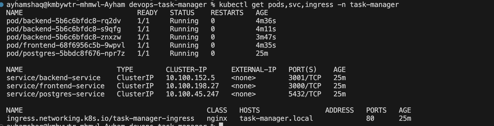
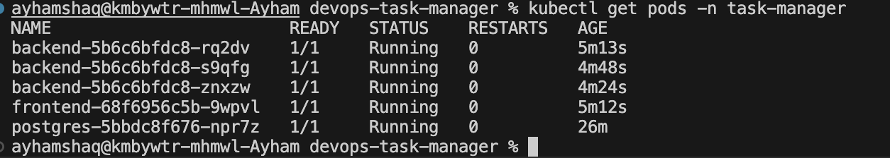
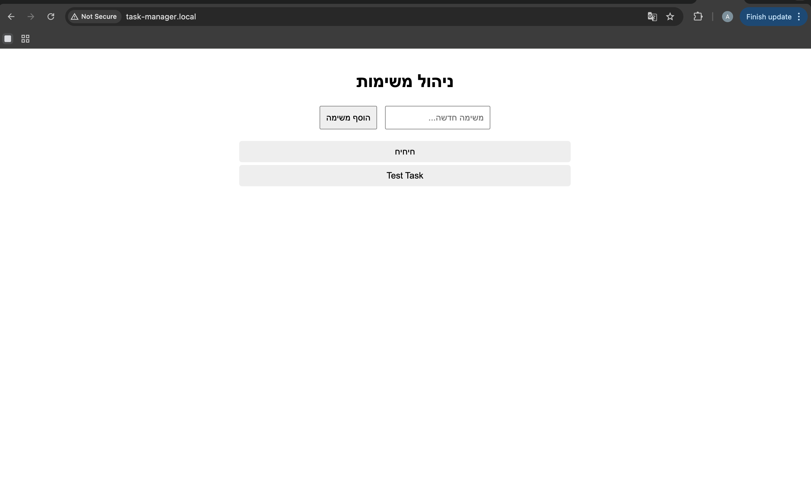
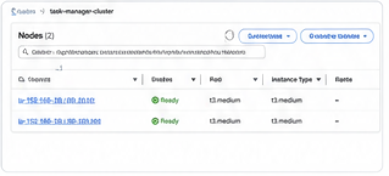
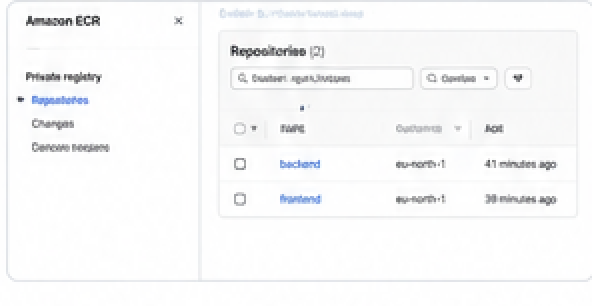
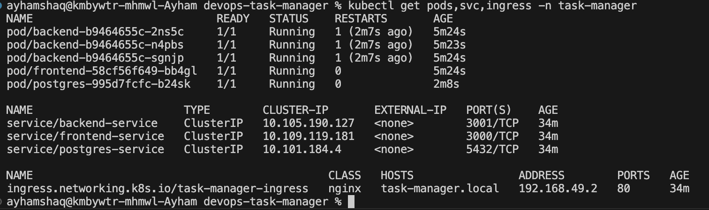
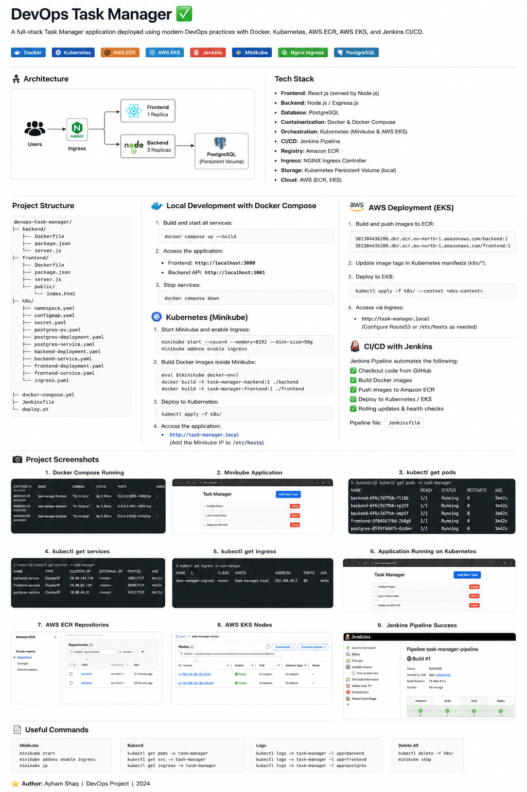

# DevOps Task Manager

A complete task management application demonstrating DevOps best practices with Frontend (React/Node.js), Backend (Node.js), and PostgreSQL database. Deployed on Kubernetes (Minikube for development and AWS EKS for production) with automated CI/CD pipeline using Jenkins.

## Project Structure

```
devops-task-manager/
├── docker-compose.yml              # Local development with Docker Compose
├── Jenkinsfile                     # CI/CD Pipeline definition
├── backend/
│   ├── package.json
│   ├── server.js                   # Express.js REST API server
│   └── Dockerfile
├── frontend/
│   ├── package.json
│   ├── server.js                   # Node.js static server + /config endpoint
│   ├── Dockerfile
│   └── public/
│       └── index.html              # SPA with task management UI
└── k8s/                            # Kubernetes manifests
    ├── namespace.yaml
    ├── secret.yaml
    ├── configmap.yaml
    ├── postgres-pv.yaml
    ├── postgres-deployment.yaml
    ├── postgres-service.yaml
    ├── backend-deployment.yaml
    ├── backend-service.yaml
    ├── frontend-deployment.yaml
    ├── frontend-service.yaml
    └── ingress.yaml
```

---

## 1. Local Development with Docker Compose

### Prerequisites
- Docker Desktop
- Docker Compose v3.8+

### Quick Start

```bash
# Clone repository
git clone https://github.com/aehamshaq123/devops-task-manager.git
cd devops-task-manager

# Start all services
docker compose up --build

# Stop services
docker compose down

# Clean up (remove volumes)
docker compose down -v
```

### Verify Services
```bash
# Frontend
curl http://localhost:3000

# Backend Health Check
curl http://localhost:3001/health

# Database Connection
psql -h localhost -U postgres -d tasksdb
```

---

## 2. Kubernetes Deployment (Minikube)

### Prerequisites
```bash
brew install minikube kubectl
```

### Setup & Deploy

```bash
# Start Minikube cluster
minikube start \
    --cpus=4 \
    --memory=8192 \
    --disk-size=50g

# Enable NGINX Ingress Controller
minikube addons enable ingress

# Configure Docker environment
eval $(minikube docker-env)

# Build images in Minikube
docker build -t task-frontend:latest ./frontend
docker build -t task-backend:latest ./backend

# Deploy to Kubernetes
kubectl apply -f k8s/

# Verify deployment
kubectl get all -n task-manager
```

### Access Application

```bash
# Add hostname to /etc/hosts
echo "$(minikube ip) task-manager.local" | sudo tee -a /etc/hosts

# Open application
open http://task-manager.local
```

### Useful Commands

```bash
# View logs
kubectl logs -n task-manager -l app=backend
kubectl logs -n task-manager -l app=frontend

# Port forward
kubectl port-forward -n task-manager svc/frontend-service 3000:3000

# Shell into pod
kubectl exec -it -n task-manager <pod-name> -- /bin/sh

# Check resource usage
kubectl top pods -n task-manager

# Cleanup
kubectl delete ns task-manager
minikube delete
```

---

## 3. AWS ECR Setup

### Create Repositories

```bash
export AWS_REGION=eu-north-1
export AWS_ACCOUNT_ID=381304436206

# Create ECR repositories
aws ecr create-repository \
    --repository-name backend \
    --region ${AWS_REGION}

aws ecr create-repository \
    --repository-name frontend \
    --region ${AWS_REGION}

# Verify
aws ecr describe-repositories --region ${AWS_REGION}
```

### Build & Push Images

```bash
export AWS_ACCOUNT_ID=381304436206
export AWS_REGION=eu-north-1
export ECR_REGISTRY=${AWS_ACCOUNT_ID}.dkr.ecr.${AWS_REGION}.amazonaws.com
export BUILD_TAG=$(date +%Y%m%d-%H%M%S)

# Login to ECR
aws ecr get-login-password --region ${AWS_REGION} | \
    docker login --username AWS --password-stdin ${ECR_REGISTRY}

# Build and push Backend
cd backend
docker build -t backend:${BUILD_TAG} .
docker tag backend:${BUILD_TAG} ${ECR_REGISTRY}/backend:${BUILD_TAG}
docker tag backend:${BUILD_TAG} ${ECR_REGISTRY}/backend:latest
docker push ${ECR_REGISTRY}/backend:${BUILD_TAG}
docker push ${ECR_REGISTRY}/backend:latest
cd ..

# Build and push Frontend
cd frontend
docker build -t frontend:${BUILD_TAG} .
docker tag frontend:${BUILD_TAG} ${ECR_REGISTRY}/frontend:${BUILD_TAG}
docker tag frontend:${BUILD_TAG} ${ECR_REGISTRY}/frontend:latest
docker push ${ECR_REGISTRY}/frontend:${BUILD_TAG}
docker push ${ECR_REGISTRY}/frontend:latest
cd ..

# Logout
docker logout ${ECR_REGISTRY}
```

### Delete Repositories

```bash
aws ecr delete-repository \
    --repository-name backend \
    --region eu-north-1 \
    --force

aws ecr delete-repository \
    --repository-name frontend \
    --region eu-north-1 \
    --force
```

---

## 4. AWS EKS Production Deployment

### Prerequisites
```bash
brew install awscli eksctl kubectl
```

### Create EKS Cluster

```bash
export AWS_REGION=eu-north-1
export CLUSTER_NAME=task-manager-cluster
export AWS_ACCOUNT_ID=381304436206

# Create cluster (15-20 minutes)
eksctl create cluster \
    --name ${CLUSTER_NAME} \
    --region ${AWS_REGION} \
    --version 1.27 \
    --nodegroup-name task-manager-nodes \
    --nodes 3 \
    --nodes-min 3 \
    --nodes-max 6 \
    --node-type t3.medium

# Verify
kubectl get nodes
```

### Install NGINX Ingress Controller

```bash
# Add Helm repository
helm repo add ingress-nginx https://kubernetes.github.io/ingress-nginx
helm repo update

# Install Ingress Controller
helm install nginx-ingress ingress-nginx/ingress-nginx \
    --namespace ingress-nginx \
    --create-namespace \
    --set controller.service.type=LoadBalancer
```

### Deploy Application

```bash
# Apply Kubernetes manifests
kubectl apply -f k8s/

# Verify deployment
kubectl get all -n task-manager
kubectl get ingress -n task-manager
```

### Access Application

```bash
# Get Load Balancer DNS
LOAD_BALANCER_DNS=$(kubectl get ingress -n task-manager \
    -o jsonpath='{.items[0].status.loadBalancer.ingress[0].hostname}')

echo "Application available at: http://${LOAD_BALANCER_DNS}"
```

### Cleanup

```bash
# Delete application
kubectl delete ns task-manager

# Delete EKS cluster
eksctl delete cluster \
    --name task-manager-cluster \
    --region eu-north-1
```

---

## 5. Jenkins CI/CD Pipeline

### Setup Jenkins

```bash
# Install Jenkins (macOS)
brew install jenkins-lts
brew services start jenkins-lts

# Access Jenkins
open http://localhost:8080
```

### Configure Credentials

In Jenkins, add the following credentials:

1. **GitHub** (ID: `github-credentials`)
   - Kind: Username with password
   - Repository: https://github.com/aehamshaq123/devops-task-manager

2. **AWS** (ID: `aws-credentials`)
   - Kind: AWS Credentials
   - Account ID: `381304436206`
   - Region: `eu-north-1`

3. **Kubeconfig** (ID: `kubeconfig-eks`)
   - Kind: Secret file
   - Upload your EKS kubeconfig

### Create Pipeline Job

1. Click **New Item**
2. Job name: `Task-Manager-Deploy`
3. Type: **Pipeline**
4. Pipeline → Definition: **Pipeline script from SCM**
5. SCM: **Git**
   - Repository URL: `https://github.com/aehamshaq123/devops-task-manager.git`
   - Branch: `*/main`
   - Script Path: `Jenkinsfile`
6. Save and click **Build Now**

### Monitor Pipeline

```bash
# Via Jenkins CLI
java -jar jenkins-cli.jar -s http://localhost:8080 \
    build "Task-Manager-Deploy" -w
```

---

## 6. Kubernetes Best Practices Implemented

✅ **Namespaces** - Resource isolation (`task-manager`)
✅ **Labels & Selectors** - Resource organization
✅ **Resource Requests/Limits** - Controlled resource allocation
✅ **Readiness & Liveness Probes** - Health checks and recovery
✅ **Rolling Updates** - Zero-downtime deployments
✅ **PersistentVolumes** - PostgreSQL data persistence
✅ **Secrets & ConfigMaps** - Configuration management
✅ **Services** - Internal and external networking
✅ **Ingress** - HTTP routing and load balancing
✅ **ImagePullPolicy** - Optimized image handling

---

## 7. Troubleshooting

### Pod Issues

```bash
# Check pod status
kubectl describe pod -n task-manager <pod-name>

# View pod logs
kubectl logs -n task-manager <pod-name>

# Check events
kubectl get events -n task-manager --sort-by='.lastTimestamp'
```

### Database Connection

```bash
# Connect to PostgreSQL
kubectl exec -it -n task-manager postgres-<id> -- \
    psql -U postgres -d tasksdb

# Check PVC status
kubectl get pvc -n task-manager
```

### Network Issues

```bash
# Test backend endpoint
kubectl port-forward -n task-manager svc/backend-service 3001:3001
curl http://localhost:3001/health

# Check Ingress status
kubectl get ingress -n task-manager -o wide
```

---

## 8. Project Information

| Item | Value |
|------|-------|
| GitHub Repository | https://github.com/aehamshaq123/devops-task-manager |
| AWS Region | eu-north-1 |
| AWS Account ID | 381304436206 |
| EKS Cluster | task-manager-cluster |
| ECR Repositories | backend, frontend |
| Kubernetes Namespace | task-manager |
| Ingress Host | task-manager.local |
| Backend Image | 381304436206.dkr.ecr.eu-north-1.amazonaws.com/backend:1 |
| Frontend Image | 381304436206.dkr.ecr.eu-north-1.amazonaws.com/frontend:1 |

---

## 9. API Endpoints

```bash
# Get all tasks
curl http://task-manager.local/api/tasks

# Add a task
curl -X POST http://task-manager.local/api/tasks \
  -H "Content-Type: application/json" \
  -d '{"title": "New Task"}'

# Frontend config
curl http://task-manager.local/config

# Backend health check
curl http://task-manager.local/api/health
```

---

## Project Screenshots

### 1. Docker Compose Running


### 2. Minikube Application


### 3. kubectl get pods


### 4. kubectl get services


### 5. kubectl get ingress


### 6. Application Running on Kubernetes


### 7. AWS ECR Repositories


### 8. AWS EKS Nodes


### 9. Jenkins Pipeline Success










---

## License

MIT License

---

## Author

DevOps Course Final Project

**Last Updated**: June 30, 2026
